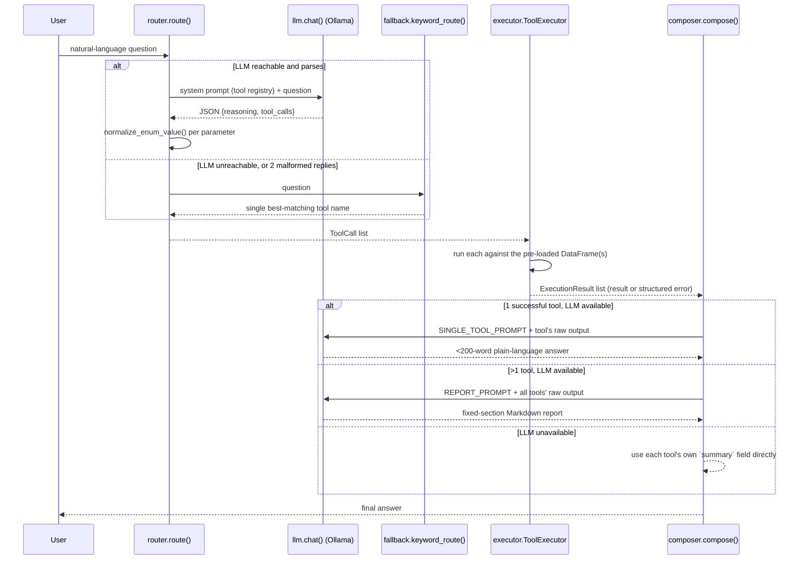

# Agent Decision Flow

Traces the complete path a question takes through `src/arol_analytics/agent/`,
from raw user text to a final answer.

## The pipeline



## 1. Query arrives

`AROLAgent.query(user_message)` (`agent/agent.py`) is the entry point used by both
the CLI (`agent/__main__.py`) and the terminal bot's free-question mode
(`bot/terminal_sim.py`). It calls `router.route()`, then `executor.execute_all()`,
then `composer.compose()`, and wraps the result in an `AgentResponse` (answer,
tool_calls, raw_data, execution_time, used_llm, reasoning, errors).

## 2. Query sent to the LLM with tool descriptions

`router._build_system_prompt()` renders `SYSTEM_PROMPT_TEMPLATE` from
`agent/router.py`, verbatim:

```
You are an AI assistant that analyzes industrial capping machine telemetry data.
You have access to the following analysis tools:

{tools}

Also available:
- meta_knowledge: for questions about how the system itself works (preprocessing, data cleaning, assumptions, how success/failure is classified) rather than questions about the data's values.
- none: if the question cannot be answered with any of the above.

Given a user question, decide which tool(s) to call and with what parameters.
Respond ONLY with a JSON object, no other text, in this exact format:
{
    "reasoning": "brief explanation of why you chose this tool",
    "tool_calls": [
        {"tool": "tool_name", "parameters": {}}
    ]
}

If the question requires multiple tools, list them in order in tool_calls.
Only include parameters the user actually specified or implied; omit the rest so the tool's defaults apply.
If you cannot answer the question with the available tools, respond with tool_calls containing a single entry: {"tool": "none", "parameters": {}}, and explain why in reasoning.
```

`{tools}` is filled in by `tools.format_registry_for_prompt()`, one line per tool
name + description, plus an indented line per parameter (name, description or
type, and `(default: ...)` where applicable) — rendered directly from
`TOOL_REGISTRY` in `agent/tools.py`, e.g.:

```
- success_rate_analysis: Success rate (successful / (successful + failed), no-load excluded) with flexible grouping. Flags groups whose success rate is more than 2 standard deviations below the average.
    - group_by: How to bucket the success rate. Use 'daily' whenever the question is about a trend, evolution, or breakdown over time/days -- 'overall' only answers a single aggregate number and cannot show how the rate changed. (default: 'overall')
    - head_filter: Optional list of head IDs to restrict to, e.g. ['H01', 'H05']. Omit for all heads.
    - time_range: Optional [start, end] ISO date/datetime strings to restrict the time window.
```

This is the same registry used to build `/examples` in the terminal bot
(`bot/registry._build_examples_text()`), so the tool descriptions a user can
discover and the ones actually driving LLM routing never drift apart.

## 3. LLM returns tool selection + parameters

`router._route_via_llm()` sends `[{"role": "system", ...}, {"role": "user",
"content": query}]` to `llm.chat()`. The reply is parsed by `_extract_json()`
(strips markdown fences, falls back to locating the outermost `{...}` span) and
validated by `_validate()` (must be a dict with a non-empty `tool_calls` list;
unknown tool names are dropped with a warning, not fatal). If parsing/validation
fails, one retry is sent with `STRICT_RETRY_SUFFIX` appended ("reply with ONLY the
JSON object..."). If both attempts fail, or `llm.chat()` raises
`OllamaUnavailableError`, `route()` falls back to keyword routing.

**Parameter repair.** Every parameter is passed through
`tools.normalize_enum_value(tool, param, value)`: if the parameter has a declared
`enum` and the LLM's value doesn't match exactly, it's matched case/separator-
insensitively (`"z-score"`/`"Z Score"` → `"zscore"`), then by substring, and
dropped (letting the tool's own default apply) if nothing matches. This is a real
bug fix, not a hypothetical: testing against Ollama Cloud found the LLM reliably
picking the right *concept* (`group_by="head"`) without reproducing the exact
required string (`"per_head"`) — `router.py`'s module docstring and
`tests/test_agent.py`'s `ENUM_NORMALIZATION_CASES` document this directly.

**Fallback: keyword routing** (`agent/fallback.keyword_route`). An ordered list of
`(keywords, tool_name)` tuples, first match wins — more specific phrases are
listed earlier (e.g. `"torque correlate"` before the generic `"torque"`, so a
correlation question doesn't get routed to plain `torque_statistics`). If nothing
matches, `route()` defaults to `generate_kpi_dashboard`. Keyword routing always
returns exactly **one** tool call — it cannot produce a multi-tool plan the way
the LLM path can.

## 4. Tool executed, result captured

`executor.ToolExecutor` (constructed once per `AROLAgent`/bot session, loading
`closure_events`/`idle_periods`/`data_quality_report.json` a single time) maps
each `ToolCall.tool` name to the real Layer-2 function via a dispatch dict built
in `_build_dispatch()`, converting router-supplied types where needed
(`_to_time_range`, `_to_threshold_range`). Every call is wrapped in
try/except — a raised exception becomes `ExecutionResult(error=str(exc))` rather
than propagating, so one bad tool call in a multi-tool request never kills the
others.

## 5. Result rendered deterministically

`composer.compose()` branches on the shape of the routing result:
- `tool_calls == [{"tool": "none"}]` → `_none_answer()`, no LLM call.
- `tool_calls == [{"tool": "meta_knowledge"}]` → `_meta_answer()` (see example 3
  below).
- Exactly one successful tool result → `_single_tool_answer()`. Numerical output
  comes only from code-owned fields; success rate has a dedicated formatter that
  prints its exact denominator and explains inferred closures. Other tools use
  their deterministic Layer-2 `summary`.
- More than one tool call (or one that failed) → `_multi_tool_answer()`, a
  deterministic Markdown list of tool summaries and structured errors.

The LLM is deliberately not called after analytics execution. A live-model test
showed that it could copy the correct percentage while inventing an inconsistent
denominator from `inferred_closures`. Ollama therefore handles language
understanding and tool selection only; formulas, values, and numerical caveats
remain owned by deterministic code.

## 6. Response returned to the user

`AROLAgent.query()` returns the composed answer plus `tool_calls`, `raw_data` (the
un-trimmed per-tool result, for a caller that wants the full numbers), and
`execution_time`. The terminal bot (Layer 4) further formats this through
`formatters.fmt_agent_response()` for HTML-ish/ANSI display.

## Fallback behavior (summary)

| Failure point | What happens |
|---|---|
| Ollama unreachable at startup | `AROLAgent.llm_available = False`; every query uses keyword routing + deterministic composition for the rest of the session. |
| LLM reachable but returns unparseable/invalid JSON | One stricter retry; if that also fails, falls back to keyword routing for that query only. |
| LLM call raises while answering a meta-knowledge question | Caught locally; verified knowledge facts are returned directly. Numerical tool answers never make a composition-time LLM call. |
| A Layer-2 tool raises | Caught in `ToolExecutor.execute`, surfaced as a structured error string in the final answer; other tool calls in the same request are unaffected. |
| No tool matches (LLM says `"none"`, or keyword routing exhausted) | `generate_kpi_dashboard` is the ultimate keyword-routing default; the LLM path can explicitly answer `"none"` with an explanation instead. |

## Report structure (multi-tool path)

Multi-tool answers list every executed tool, its parameters, and its deterministic
summary in order, followed by any structured errors. This is intentionally the
same whether LLM routing or keyword fallback selected the tools.

---

## Three traced examples

The LLM-routing JSON shown below is illustrative of what the system prompt
requests, since routing depends on Ollama actually being reachable. Everything
downstream of it doesn't: per the deterministic-composition design (step 5
above), the composed answer is identical whether `use_llm` is `True` or `False`
— routing may use the LLM, but the numbers never do. So the tool results and
answers below are the real output against `data/processed/`, reproducible
without an LLM. The routing step itself has separately been validated
end-to-end against live Ollama Cloud (`gpt-oss:120b`) on this exact query set.

### 1. Simple: "What is the overall success rate?" → single tool

Keyword fallback (`keyword_route`) matches `"success rate"` → `success_rate_analysis`
(the LLM path would produce the same tool with `{}` parameters, since no grouping
was requested):

```
tool_calls: [ToolCall(tool='success_rate_analysis', parameters={})]
ANSWER:
Success rate (overall)

- Successful observed outcomes: 31,670,096
- Failed observed outcomes: 1,096
- Other observed outcomes (excluded): 12
- Success rate: 99.9965%

Formula:
31,670,096 / (31,670,096 + 1,096) = 31,670,096 / 31,671,192 = 99.9965%

No-load events are excluded from the denominator.
The 580,418 additional inferred closures come from counter jumps: they do not have an individually observed status and are not automatically missing or corrupted data.
```

`success_rate_analysis` gets a dedicated formatter (`composer._format_success_rate`)
rather than the generic `summary`-field path — it spells out the exact formula and
denominator so a reader (or an LLM reading the answer downstream) can't mistake
`99.9965%` for a rounded `100.00%`, and can't confuse the counter-jump-inferred
closures with missing data.

### 2. Complex: "Explain why head H29 has more failed closures." → multiple tools

This is the kind of question that needs the LLM path — keyword fallback can only
return one tool, but explaining *why* one head differs needs both a cross-head
baseline and a head-specific deep-dive. Given the system prompt, an LLM would be
expected to return something shaped like:

```json
{
  "reasoning": "Comparing H29 against all heads shows whether it's really an outlier, and a head-filtered failure breakdown explains what kind of failures dominate.",
  "tool_calls": [
    {"tool": "head_comparison", "parameters": {}},
    {"tool": "failure_analysis", "parameters": {"head_filter": ["H29"]}}
  ]
}
```

Output against the full archive:

```
## Report

### Analyses Executed
- **head_comparison**({}): Compared 36 heads. 5 flagged as statistical outliers. Most closures: H33 (1,531,775); fewest: H13 (1,531,119). Kruskal-Wallis on torque across heads: p=0 (significant).
- **failure_analysis**({'head_filter': ['H29']}): 117 failures across 1 heads. 1 day(s) with elevated failure rate. 1 consecutive-failure burst(s) (>=3 in a row) detected.
```

`head_comparison`'s `flagged_heads` (not shown in the trimmed summary above)
includes `"H29 has significantly lower success rate (99.987 vs group avg
99.997)"`, and `failure_analysis`'s `failure_distribution_by_status_code` for H29
is dominated by status 65 (RotatingAtRaise) — the cap was still rotating when the
head raised. `_multi_tool_answer()` produces this exact Markdown list **regardless
of `use_llm`** — there is no LLM-based `REPORT_PROMPT` path any more (an earlier
version of the composer did send multi-tool results to the LLM for a prose report;
it was removed after a live-model test showed the LLM could copy the right
percentage while inventing an inconsistent denominator — see step 5 above). The
router may still use the LLM to *choose* `head_comparison` + `failure_analysis` in
the first place; only the numeric write-up is deterministic.

### 3. Meta: "What preprocessing steps were applied to the raw data?" → knowledge base

Both routing paths agree this is a meta question:

```
matched topics: ['preprocessing']
keyword fallback tool_calls: [ToolCall(tool='meta_knowledge', parameters={})]
```

(An LLM given the system prompt would independently classify this as
`{"tool": "meta_knowledge", "parameters": {}}`, since the question is about the
*system*, not the data's values — the system prompt explicitly carves out
`meta_knowledge` for exactly this case.) `composer._meta_answer()` looks up the
matched topic(s) in `knowledge.META_KNOWLEDGE` and, without an LLM, returns the
raw fact text directly:

```
"89 daily CSV files (Feb-Apr 2026, ~4.6 GB total) covering 36 heads are read in chronological order. Each file is schema-validated (timestamp column + H{nn} Count/AppTorque/Status triplets); a malformed file is rejected without stopping the pipeline. Trailing all-zero padding rows are stripped. Corrupted mid-file Count readings (sensor blips) are detected and masked before closures are counted. Closures are detected per head from Count increments, enriched with readable status labels and derived metrics, true duplicate closures are removed, and everything is written to closure_events.parquet + idle_periods.parquet."
```

With the LLM available, the same facts would be rephrased conversationally
(`_meta_answer`'s LLM prompt: "Answer conversationally in under 150 words, using
only the facts above") rather than returned as the raw knowledge-base string.
