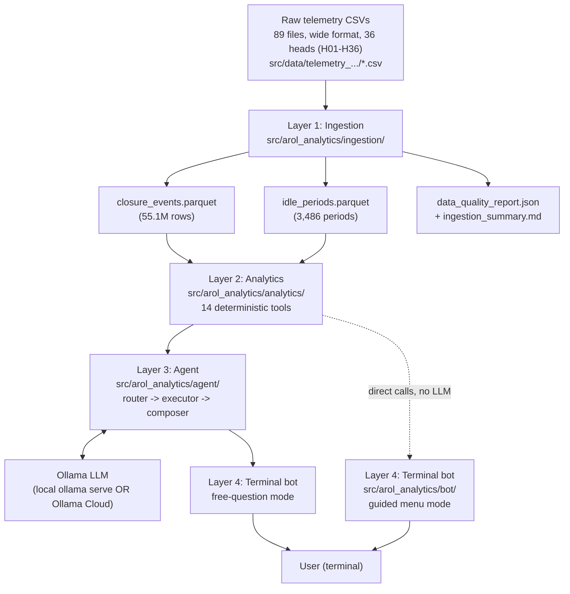

# Architecture

## System overview

The project is a four-layer pipeline that turns raw AROL capping-machine telemetry
into natural-language answers, reachable either through a guided menu or free-text
questions in a terminal chat interface.

**Layer 1 — Ingestion** (`src/arol_analytics/ingestion/`) reads the raw wide-format
CSVs, validates their schema, detects per-head closures from cumulative counter
increments, cleans corrupted/duplicate readings, detects machine-wide idle periods,
and writes two clean Parquet datasets plus a JSON/Markdown quality report.

**Layer 2 — Analytics** (`src/arol_analytics/analytics/`) is a set of 14
deterministic, stateless functions ("tools") over the Layer-1 Parquet output. Each
one returns a JSON-serializable dict that always includes a human-readable
`summary` string, so a caller (human, agent, or bot) never has to parse a raw table
to get a sensible answer.

**Layer 3 — Agent** (`src/arol_analytics/agent/`) turns a natural-language question
into one or more Layer-2 tool calls, executes them, and composes a readable answer.
It uses an LLM (via Ollama, local or cloud) when reachable, and degrades to
deterministic keyword routing + the tools' own `summary` fields when it isn't — the
agent never goes silent for lack of an LLM.

**Layer 4 — Terminal bot** (`src/arol_analytics/bot/`) is a chat-style terminal
interface built on top of Layers 2 and 3. Important nuance not obvious from the
module name: **this is not a live network-facing Telegram bot.** `bot/terminal_sim.py`
reuses `python-telegram-bot`'s `InlineKeyboardMarkup`/`InlineKeyboardButton` purely
as a convenient `(label, callback_data)` data container — numbered choices printed
to the terminal stand in for tapping an inline button. There is no `telegram.ext`
polling loop, no bot token, and no network service anywhere in the code (confirmed
by reading every file under `bot/` and `grep`-ing the whole package for
`bot_token`/`Application.builder`/`run_polling`, none of which exist). It runs
entirely locally as `python -m arol_analytics.bot [data_dir]`. It offers two modes:
a guided menu (Mode 1, calls Layer-2 tools directly, no LLM involved at all) and
free-text questions (Mode 2, routed through the Layer-3 `AROLAgent`).

---

## Layer 1 — Data Ingestion

**Input.** `src/data/telemetry_MCC.../*.csv` — 89 daily files, wide format. Each
file has one `timestamp` column plus, for every head, three columns:
`H{nn} Count`, `H{nn} AppTorque`, `H{nn} Status`.

**Column layout discovery.** The columns are **grouped by field, not interleaved
per head**: all 36 `H{nn} Count` columns first, then all 36 `H{nn} AppTorque`
columns, then all 36 `H{nn} Status` columns — not
`H01 Count, H01 AppTorque, H01 Status, H02 Count, ...` as a literal reading of
"per-head triplets" might suggest. This was confirmed by scanning every file before
writing the parser (`ingestion/pipeline.py` module docstring) and is handled
transparently by the regex-based column matcher
`HEAD_COLUMN_RE = re.compile(r"^(H\d{2})\s+(Count|AppTorque|Status)$")`
in `ingestion/schema.py` — the loader groups columns by head after parsing, so the
physical ordering in the file doesn't matter to any downstream code. Only 36 heads
(H01–H36) exist in the archive, even though `MAX_HEADS = 48` in `schema.py` is kept
as the ceiling the regex allows, not an assumption baked into the row count.

**Closure detection** (`ingestion/closures.detect_closures`). A closure event is
recorded whenever a head's `Count` increases versus the last *valid* value seen for
that head — comparisons use `ffill()` over corrupted (masked-to-NaN) readings, so a
reporting glitch is never misread as a reset. State (`CarryState`: last count per
head, last timestamp, per-head reset-segment id, accumulated reset events) is
threaded from one file to the next, so increments, reset segmentation, and
sampling-gap detection are all correct **across file boundaries** without ever
holding more than one file's data in memory at once — verified against a true
single-file merge, which produced byte-identical closure counts. Because `Count`
can jump by more than 1 between two observed rows, each event records
`counter_delta` (size of the jump) and `inferred_closure_count` (closures implied
for production totals, currently always equal to `counter_delta`), tagged
`data_quality`: `"single"` (jump of 1, normal interval), `"aggregated"` (jump >1
within a normal interval), or `"gap"` (the jump spans a detected sampling gap, so
only the last closure's torque/status/timestamp in the run is actually known).

**Cleaning.**
- *Corrupted `Count` readings*: `ingestion/quality.mask_corrupted_count_readings`
  nulls out (never drops) a head's `Count` for a contiguous `Count==0` run when the
  value immediately after the run is at or above the value immediately before it
  (`post >= pre`) — proof the counter kept incrementing for real and just wasn't
  reported, not a genuine reset. A genuine reset (`post << pre`, production resumes
  near zero) is left untouched. This was verified against **every one of the 2,088
  `Count==0` runs** in the archive and gives a clean split with zero borderline
  cases (corrupted runs top out at 665 rows; genuine resets start at 1,341 rows).
  On the current archive this masks **96,518** cells before closure detection.
- *Duplicate events*: `ingestion/normalize.dedupe_events` drops duplicate
  `(head_id, segment_id, counter)` triples within an unbroken counter segment
  (`segment_id` comes directly from the raw per-row sequence in `closures.py`, not
  reconstructed after the fact, so it's correct even when a real reset's first
  recovered value already matches or exceeds the pre-reset peak). On the current,
  already-cleaned archive this finds **0** true duplicates — an earlier pipeline
  version (before the corrupted-`Count` fix above existed) found 551, all traced to
  the same corrupted readings now caught upstream.
- *Counter resets* (`Count` decreasing): excluded from closure/delta math and
  recorded separately. **108** genuine resets on the current archive, correctly
  counted across file boundaries.
- *Trailing all-zero rows*: some files end with a literal all-zero row for every
  head. These are **preserved, not dropped** — a genuine reset/outage can cross a
  daily file boundary, so a file-local trailing zero run isn't sufficient evidence
  of export padding; a later file's first non-zero value is used to classify it.
  **2,688** such rows preserved on the current archive.

**Outputs** (`data/processed/`, gitignored, regenerated by the pipeline):
- `closure_events.parquet` — **55,130,461 rows** (55,954,882 inferred closures).
- `idle_periods.parquet` — **3,486 periods**.
- `data_quality_report.json` + `ingestion_summary.md` — machine- and
  human-readable quality reports.

**Configurable thresholds** (`ingestion/schema.py`) — framed as configuration-driven
design choices, not hardcoded magic numbers:

| Constant | Value | Justification |
|---|---|---|
| `IDLE_MIN_ROWS` | 30 | An idle *run* (all 36 heads simultaneously `Status=2`) must span at least 30 rows to count as a real idle period — shorter all-heads-idle blips are normal inter-batch gaps, not a stoppage worth reporting. |
| `IDLE_MIN_SECONDS` | 30.0 | Same idea expressed in time, in case sampling interval varies; a run is kept if it meets *either* the row or the time threshold (`ingestion/idle.finalize_idle_periods`). |
| `GAP_FACTOR` | 2.0 | A sampling gap is flagged when the interval between two consecutive rows exceeds `GAP_FACTOR × median_interval` for that stretch — a standard multiple-of-median approach to temporal anomaly detection that adapts to each file's own sampling rate rather than a fixed-seconds cutoff. Used both for per-file gap detection (`quality.compute_file_quality`) and for tagging a closure jump `data_quality="gap"` (`closures.detect_closures`). |
| `FILE_BOUNDARY_TOLERANCE_SECONDS` | 5.0 | Two files are treated as time-contiguous (idle runs merged across the boundary) if the gap between the last row of one and the first row of the next is ≤ 5s — allows for small write-time jitter between daily exports without falsely splitting one idle period into two. |

---

## Layer 2 — Baseline Analytics

`src/arol_analytics/analytics/` exposes **14** deterministic functions (the
original spec called for 10; four more — `list_events`, `torque_outcome_comparison`,
`torque_success_correlation`, `render_chart` — were added as the tool set matured).
Every function takes the loaded `closure_events`/`idle_periods` DataFrame(s) plus
optional filters, and returns a dict that always includes a `summary` string. See
[analytics_methods.md](analytics_methods.md) for full per-tool detail.

1. `dataset_summary` — dataset overview.
2. `success_rate_analysis` — success rate with flexible grouping.
3. `torque_statistics` — torque distribution stats.
4. `torque_trend_analysis` — drift/trend detection over time.
5. `anomaly_detection` — torque outliers + failure-rate spikes.
6. `head_comparison` — cross-head comparison + Kruskal-Wallis test.
7. `failure_analysis` — failure deep-dive.
8. `capping_speed_analysis` — production speed, machine-wide and per-head.
9. `idle_analysis` — idle-period statistics.
10. `generate_kpi_dashboard` — one-call KPI rollup.
11. `list_events` — raw filtered event listing.
12. `torque_outcome_comparison` — successful-vs-failed torque comparison (Mann-Whitney U).
13. `torque_success_correlation` — per-head torque/success-rate Pearson correlation.
14. `render_chart` (tool name `visualize` in the agent registry) — matplotlib PNG charts.

**Statistical methods used:** z-score and IQR outlier flagging (`anomaly_detection`,
`_common.group_mean_std_flags`), Kruskal-Wallis (`head_comparison`, torque across
heads), Mann-Whitney U (`torque_outcome_comparison`), Pearson correlation
(`torque_success_correlation`), and ordinary least-squares linear regression via
`scipy.stats.linregress` (`torque_trend_analysis`, slope in Nm/day).

**Caveats discovered during validation** (all baked into the tools' own `summary`
output, not left for a caller to rediscover):
- **Bimodal torque**: near 0 Nm during no-load (`status=2`), ~2 Nm during real
  closures. `torque_statistics` defaults to `filter_status="successful_only"` and
  emits an explicit `BIMODAL_WARNING` whenever `filter_status="all"` mixes the two
  populations.
- **Large-N p-value trap**: `torque_trend_analysis` finds a "statistically
  significant" trend on essentially every head (p as low as ~1e-85 on the full
  archive) with mean r² around **0.0004** — time explains ~0.04% of torque
  variance. With ~900k events per head, even a negligible slope clears p<0.05. The
  tool appends a CAVEAT line to its own `summary` whenever mean r² < 0.01, so an
  agent reading only the summary won't mistake statistical significance for
  practical relevance.
- **Zero-torque anomalies are sensor artifacts, not mechanical failures** — they
  come from the no-load population or corrupted readings, not genuine process
  faults (see [analytics_methods.md](analytics_methods.md) and
  `agent/knowledge.py`'s `torque_caveat`/`corrupted_readings` entries).
- **Near-perfect success rate**: 1,096 failures out of 55,130,461 observed closure
  events (31,670,096 successful + 1,096 failed + 23,459,257 no-load + 12 other) —
  success rate excluding no-load is 100.00% to two decimal places.

---

## Layer 3 — Agentic Orchestration

`src/arol_analytics/agent/` implements a router → executor → composer pipeline over
the Layer-2 tools. Full trace with worked examples in
[agent_flow.md](agent_flow.md); summary here.

**LLM backend** (`agent/llm.py`): a thin HTTP client for the **Ollama** chat API —
no OpenAI/Anthropic paid API is used. It works against either a local
`ollama serve` (`http://localhost:11434`, no auth) or **Ollama Cloud**
(`https://ollama.com`, needs `OLLAMA_API_KEY` from ollama.com/settings/keys, no
local install required). Setting `OLLAMA_API_KEY` switches the default host to the
cloud automatically; `AROL_OLLAMA_HOST` always wins if set explicitly. The model is
`AROL_LLM_MODEL` env var, default `"mistral"` (a local-only default — a cloud
deployment needs a model name from `ollama.com/models`, passed without the local
`:cloud` suffix).

**System prompt** — see [agent_flow.md](agent_flow.md) for the full text and trace,
reproduced verbatim from `agent/router.py`'s `SYSTEM_PROMPT_TEMPLATE`.

**Tool registry** (`agent/tools.py`): `TOOL_REGISTRY`, a list of dicts (name,
description, parameters with types/enums/defaults, example questions) — one entry
per Layer-2 tool, rendered as text into the router's system prompt by
`format_registry_for_prompt()`. The same registry backs the bot's `/examples`
command (Layer 4) and `agent/tools.normalize_enum_value()`, which repairs an LLM's
close-but-not-exact enum string (e.g. `group_by="head"` → `"per_head"`) by
case/separator-insensitive matching, falling back to substring matching, and
dropping the parameter (letting the tool's own default apply) if nothing matches.

**Query routing** (`agent/router.py`): sends the question + rendered registry to
the LLM, expects a JSON object `{"reasoning": ..., "tool_calls": [{"tool": ...,
"parameters": {...}}, ...]}`. If the response isn't valid JSON matching that shape,
one stricter retry is sent (`STRICT_RETRY_SUFFIX`, forbidding markdown fences or
extra text). If that also fails, or Ollama is unreachable at all, routing falls
back to `agent/fallback.keyword_route()` — an ordered list of keyword tuples
(`KEYWORD_MAP`), first match wins, most-specific phrases listed first (e.g. "torque
correlate" before the generic "torque"). If nothing matches, `route()` defaults to
`generate_kpi_dashboard`.

**Tool execution** (`agent/executor.py`): `ToolExecutor` loads
`closure_events`/`idle_periods`/`data_quality_report.json` **once** at construction
(not per query), maps each tool name to the real Layer-2 function signature, and
wraps every call so an exception becomes a structured `ExecutionResult(error=...)`
instead of crashing the agent.

**Response composition** (`agent/composer.py`): with the LLM available, a single
successful tool call is summarized by `SINGLE_TOOL_PROMPT` (plain-language answer,
<200 words); multiple tool calls are summarized by `REPORT_PROMPT` into a
fixed-section Markdown report (`## Report: {goal}` / `### Data Used` /
`### Analyses Executed` / `### Findings` / `### Confidence & Limits` /
`### Recommended Next Steps`). Without the LLM (or if it errors mid-composition),
`compose()` falls back to the tool's own `summary` field directly for a single
tool, or a plain bullet list of each tool's summary for multiple tools — so the
agent never goes silent for lack of an LLM.

**Fallback logic**: every stage degrades gracefully — no LLM reachable → keyword
routing + summary-field composition; LLM reachable but returns unparseable JSON
twice → same fallback; a tool raises inside the executor → structured error
surfaced in the final answer, other tool calls in the same request still run.

**Meta/system questions** (`agent/knowledge.py`): a static `META_KNOWLEDGE` dict of
verbatim facts about preprocessing, closure detection, corrupted-reading handling,
timestamps, status codes, and known caveats — matched to a question via
`TOPIC_KEYWORDS`, answered either as raw facts (no LLM) or rephrased
conversationally by the LLM strictly from those facts (`compose._meta_answer`).

---

## Layer 4 — Terminal Bot

`src/arol_analytics/bot/` — a terminal chat interface, run as
`python -m arol_analytics.bot [data_dir]` (`bot/__main__.py` →
`bot/terminal_sim.main`). As noted above, **it is a local terminal simulator, not a
network-facing Telegram bot** — `python-telegram-bot`'s keyboard classes are reused
purely as an in-memory `(label, callback_data)` container.

**Two modes:**
- **Guided menu** (Mode 1): numbered choices standing in for inline buttons,
  calling Layer-2 tools **directly** — no LLM, no Layer-3 agent involved at all.
  Driven by `bot/registry.py`'s `RUN_ACTIONS`/`FLOW_ACTIONS` dicts, which map a
  `callback_data` string to a `RunAction(tool, params, formatter, menu_target,
  is_chart)`.
- **Free natural language** (Mode 2): any non-numeric, non-`/command` input is
  routed through `AROLAgent.query()` (Layer 3), so it inherits the LLM-or-fallback
  behavior described above.

**Menu structure** (`bot/keyboards.py` + `bot/registry.py`): a `main_menu()` with
one entry per analysis category (KPI Dashboard, Success Rate, Torque, Anomaly
Detection, Head Comparison, Failure Analysis, Production & Speed, Idle &
Utilization, Dataset Info, Visualizations, Free Question, Help), each opening a
submenu of specific tool+parameter combinations. Two guided sub-flows collect
additional input before running a tool: a head/time-range picker
(`c:<flow>:head` → `h:<flow>:<HEAD|all>` → `t:<flow>:<preset>`, presets built from
the dataset's actual min/max timestamp by `bot/time_presets.build_time_presets`,
not hardcoded) and a free-text custom anomaly-threshold prompt
(`c:threshold:minmax`, parsed as `min,max`).

**Message formatting** (`bot/formatters.py`): every `fmt_*` function returns
`(short, full)` — `short` is always shown immediately; `full` is `None` unless
there's a bigger table worth hiding behind a "Show Full Table" button (rendered via
`make_table()`, a plain monospace table wrapped in a Telegram-HTML-style `<pre>`
tag). A small HTML-ish tag subset (`<b>`, `<i>`, `<pre>`) is the shared markup
between formatting and terminal rendering — `terminal_sim.html_to_terminal()`
converts it to ANSI styling (bold/italic) for the terminal, or strips it if the
terminal isn't a TTY. Long tables (>8 rows for most tools) show a short
best/worst-highlighted summary with the full table stashed for the "Show Full
Table" numbered option; the multi-tool agent report (Markdown from
`composer.REPORT_PROMPT`) is converted to the same HTML-ish subset by
`_markdown_lite_to_html()` since Telegram HTML mode — and this terminal's tag
converter — can't render raw Markdown headers/bold.

**Data loading and caching**: `TerminalSession.__init__` builds one `AROLAgent`
(which itself builds one `ToolExecutor`, loading `closure_events`/`idle_periods`
**once**) for the whole session; every guided or free-form request reuses the same
in-memory DataFrames — there is no per-request reload.

**Agent initialization**: `main()` constructs a single `AROLAgent(args.data_dir,
model=config.LLM_MODEL)` (`config.LLM_MODEL` reads `AROL_LLM_MODEL`, else the
agent's own default) before entering the input loop, so LLM availability is
checked once at startup, not per message.

**Error handling and UX**: a guided-tool exception is caught in
`TerminalSession.run_action` and shown via `formatters.fmt_tool_error` (never
crashes the session); a free-question exception is caught in
`handle_free_question` and shown as a generic "couldn't process that" message
suggesting `/menu`; a chart result with no data returns its `summary` text instead
of an image; charts are saved to `charts/` on disk (there is no inline image
display in a terminal) and, on macOS only, opened automatically via `open`
(best-effort, failure is silently ignored — the file is saved either way).
`/status` reports live LLM reachability, loaded row/head counts, uptime, and a
guided-vs-free request counter for the session.
